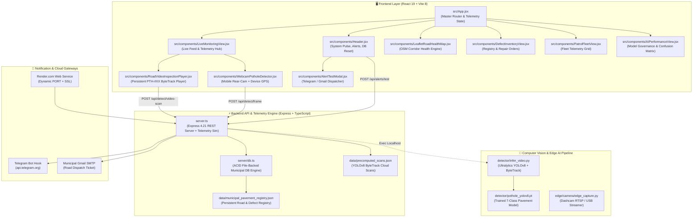

# 🌐 Interactive Codebase Structure & Knowledge Graph (Graphify)

Generated at: `2026-09-12T16:30:24.266Z`
Total Modules / Nodes: **31** | Relationships / Links: **41**

---

## 🏛️ System Architecture Graph (End-to-End Dataflow)

---

## 📂 Codebase File Index & Module Taxonomy

| Category | File | Description |
| :--- | :--- | :--- |
| **Server & Config** | `server.ts` | Core REST server, GIS math, transit simulation, alert dispatcher. |
| **Database** | `server/db.ts` | ACID file-backed storage, health scoring, work orders. |
| **UI Router** | `src/App.jsx` | Navigation bar, global polling, tab router, live counters. |
| **Component** | `src/components/Header.jsx` | Subsystem status lights, live toggle, CSV/DB backup, DB reset. |
| **Component** | `src/components/LiveMonitoringView.jsx` | Edge dashcam stream, video switcher, live ingestion sidebar. |
| **Component** | `src/components/RoadVideoInspectionPlayer.jsx` | ByteTrack player, locked %, out-of-range finalizer, PTH-#XX tags. |
| **Component** | `src/components/WebcamPotholeDetector.jsx` | Real phone back-camera, hardware torch, mobile GPS tracker. |
| **Component** | `src/components/LeafletRoadHealthMap.jsx` | OpenStreetMap vector corridor renderer, health grades, bus pins. |
| **Component** | `src/components/DefectInventoryView.jsx` | Defect registry table and municipal repair work order manager. |
| **Component** | `src/components/PatrolFleetView.jsx` | Real-time vehicle cards, hardware specs, speeds, headings. |
| **Component** | `src/components/AIPerformanceView.jsx` | mAP, precision, recall, 7x7 confusion matrix. |
| **Component** | `src/components/AlertTestModal.jsx` | Telegram & Gmail setup, 4 criteria rules, test alert trigger. |
| **AI Detector** | `detector/infer_video.py` | YOLOv8 ByteTrack Python video inference engine. |
| **AI Model** | `detector/pothole_yolov8.pt` | Trained PyTorch weights for 7 pavement defect classes. |
| **Cloud Deploy** | `render.yaml` | Blueprint for zero-config Render Node deployment. |

---

✅ Generated successfully via Graphify.