# 🌐 Interactive Codebase Structure & Knowledge Graph (Graphify)

Generated at: `2026-09-13T14:06:48.897Z`
Total Modules / Nodes: **43** | Relationships / Links: **52**

---

## 🏛️ System Architecture Graph (End-to-End Dataflow)

```mermaid
graph TD
  subgraph Frontend ["🖥️ Frontend Layer (React 19 + Vite 8)"]
    APP["src/App.jsx<br/>(Master Router & Model State)"]
    HDR["src/components/Header.jsx<br/>(Dual Model Switch, Pulse, Alerts)"]
    LIVE["src/components/LiveMonitoringView.jsx<br/>(Live Feed & Telemetry Hub)"]
    GMAP["src/components/GoogleRoadHealthMapView.jsx<br/>(Google Maps GIS Engine)"]
    LMAP["src/components/LeafletRoadHealthMap.jsx<br/>(OSM Corridor Health Engine)"]
    INV["src/components/DefectInventoryView.jsx<br/>(Registry & Repair Orders)"]
    FLEET["src/components/PatrolFleetView.jsx<br/>(Fleet Telemetry Grid)"]
    PERF["src/components/AIPerformanceView.jsx<br/>(Dual Model Governance & mAP)"]
    
    VID["src/components/RoadVideoInspectionPlayer.jsx<br/>(ByteTrack Video Player)"]
    CAM["src/components/WebcamPotholeDetector.jsx<br/>(Mobile Rear-Cam + Device GPS)"]
    ALERTS["src/components/AlertTestModal.jsx<br/>(Telegram / Gmail Dispatcher)"]

    APP --> HDR
    APP --> LIVE
    APP --> GMAP
    APP --> LMAP
    APP --> INV
    APP --> FLEET
    APP --> PERF
    HDR --> ALERTS
    LIVE --> VID
    LIVE --> CAM
  end

  subgraph Backend ["⚡ Backend API & Telemetry Engine (Express + TypeScript)"]
    SERVER["server.ts<br/>(REST Server + Dynamic Model Router)"]
    DB["server/db.ts<br/>(ACID File-Backed Municipal DB Engine)"]
    REG["data/municipal_pavement_registry.json<br/>(Persistent Road & Defect DB)"]
    CACHE["data/precomputed_scans.json<br/>(Cloud Precomputed Keyframes)"]

    SERVER --> DB
    DB --> REG
    SERVER --> CACHE
  end

  subgraph EdgeAI ["🧠 Computer Vision & Edge AI Pipeline"]
    INFER_V["detector/infer_video.py<br/>(YOLOv8 + ByteTrack Video Infer)"]
    INFER_I["detector/infer_image.py<br/>(YOLOv8 Single Frame Infer)"]
    M_POT["detector/pothole_yolov8.pt<br/>(🎯 Pothole Dedicated Model - 99.5% mAP)"]
    M_RDD["detector/rdd2022_multiclass.pt<br/>(🌐 7-Class RDD2022 Model - 99.2% mAP)"]
    CAPTURE["edge/camera/edge_capture.py<br/>(Dashcam RTSP / USB Streamer)"]

    INFER_V --> M_POT
    INFER_V --> M_RDD
    INFER_I --> M_POT
    INFER_I --> M_RDD
    SERVER -.->|Exec Localhost| INFER_V
    SERVER -.->|Exec Localhost| INFER_I
  end

  subgraph ML_Pipeline ["🚀 ML Training & Cloud Pipelines"]
    COLAB["ml/Train_RDD2022_YOLOv8_Colab.ipynb<br/>(Google Colab GPU Notebook)"]
    CONV["ml/scripts/convert_rdd2022_to_yolo.py<br/>(RDD2022 VOC XML to YOLO Converter)"]
    TRAIN["ml/training/train_rdd2022.py<br/>(YOLOv8s GPU Training Script)"]

    COLAB --> CONV
    COLAB --> TRAIN
    TRAIN --> M_RDD
  end

  subgraph External ["🚨 Notification & Cloud Gateways"]
    TG["Telegram Bot Hook<br/>(api.telegram.org)"]
    GMAIL["Municipal Gmail SMTP<br/>(Road Dispatch Ticket)"]
    RENDER["Render.com Web Service<br/>(Dynamic PORT + SSL)"]

    SERVER --> TG
    SERVER --> GMAIL
    RENDER --> SERVER
  end

  VID -->|POST /api/videos/scan| SERVER
  CAM -->|POST /api/detect| SERVER
  HDR -->|POST /api/alerts/test| SERVER
```

---

## 📂 Codebase File Index & Module Taxonomy

| Category | File | Description |
| :--- | :--- | :--- |
| **Server & Router** | `server.ts` | REST API, dynamic YOLOv8 model resolver (`resolveModelPath`), spatial deduplication, GIS math. |
| **Database** | `server/db.ts` | ACID file-backed storage, health scoring, work orders. |
| **UI Router** | `src/App.jsx` | Navigation bar, global polling, dual model state (`aiModelMode`), live counters. |
| **Component** | `src/components/Header.jsx` | Subsystem status lights, AI Model Switcher (Pothole Dedicated vs 7-Class RDD2022), DB reset. |
| **Component** | `src/components/LiveMonitoringView.jsx` | Edge dashcam stream, video switcher, live ingestion sidebar. |
| **Component** | `src/components/RoadVideoInspectionPlayer.jsx` | ByteTrack player, locked %, out-of-range finalizer, PTH-#XX tags. |
| **Component** | `src/components/WebcamPotholeDetector.jsx` | Real phone back-camera, hardware torch, mobile GPS tracker. |
| **Component** | `src/components/GoogleRoadHealthMapView.jsx` | Google Maps Photorealistic 3D vector corridor renderer & pins. |
| **Component** | `src/components/LeafletRoadHealthMap.jsx` | OpenStreetMap vector corridor renderer, health grades, bus pins. |
| **Component** | `src/components/DefectInventoryView.jsx` | Defect registry table and municipal repair work order manager. |
| **Component** | `src/components/PatrolFleetView.jsx` | Real-time vehicle cards, hardware specs, speeds, headings. |
| **Component** | `src/components/AIPerformanceView.jsx` | Dual model governance, mAP, precision, recall comparison charts. |
| **Component** | `src/components/AlertTestModal.jsx` | Telegram & Gmail setup, 4 criteria rules, test alert trigger. |
| **AI Inference** | `detector/infer_video.py` | YOLOv8 ByteTrack Python video inference engine. |
| **AI Inference** | `detector/infer_image.py` | YOLOv8 Single-frame Python image inference engine. |
| **AI Model** | `detector/pothole_yolov8.pt` | Trained PyTorch weights for dedicated single-class pothole detector (99.5% mAP). |
| **AI Model** | `detector/rdd2022_multiclass.pt` | Trained PyTorch weights for 7-class RDD2022 road defect model (99.2% mAP). |
| **ML Pipeline** | `ml/Train_RDD2022_YOLOv8_Colab.ipynb` | Google Colab 1-click GPU training notebook. |
| **ML Pipeline** | `ml/scripts/convert_rdd2022_to_yolo.py` | RDD2022 VOC XML to YOLO format dataset generator. |
| **ML Pipeline** | `ml/training/train_rdd2022.py` | YOLOv8 road-optimized GPU training script. |
| **Cloud Deploy** | `render.yaml` | Blueprint for zero-config Render Node deployment. |

---

✅ Generated successfully via Graphify.