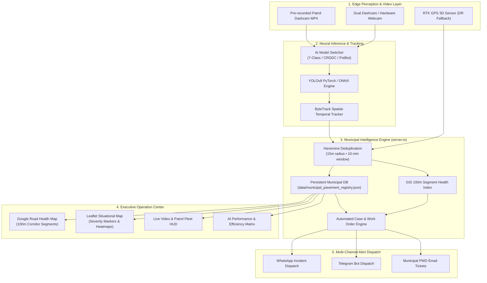

# 🛣️ AI Road Intelligence & Pavement Condition Platform
### *Autonomous Edge-AI Road Distress Surveillance, GIS 100m Segmentation & Municipal Governance*

[](https://huggingface.co/Logesshhh/road-anomaly-pothole-yolov8m)
[](https://github.com/ultralytics/ultralytics)
[](https://react.dev/)
[](https://www.typescriptlang.org/)
[](LICENSE)

An enterprise-grade, end-to-end municipal road asset management system. Public transit fleets and patrol vehicles equipped with dashcams and GPS run real-time YOLOv8 neural inference at the edge. Detections are spatially deduplicated across 100-meter GIS road corridors, logged into an ACID-compliant municipal database, mapped on dual GIS engines (Google Maps & Leaflet), and automatically escalated through a closed-loop municipal work order lifecycle with instant multi-channel dispatch (WhatsApp, Telegram, Email).

---

## 🧠 Tri-Model AI Ecosystem

All model weights and ONNX runtimes are hosted on the [Hugging Face Model Hub: Logesshhh/road-anomaly-pothole-yolov8m](https://huggingface.co/Logesshhh/road-anomaly-pothole-yolov8m).

```
Hugging Face Repository: https://huggingface.co/Logesshhh/road-anomaly-pothole-yolov8m
```

| Model | Architecture | Weights File | Size | Latency | Detected Classes | Primary Use Case |
| :--- | :--- | :--- | :--- | :--- | :--- | :--- |
| **🎯 7-Class Road Anomaly** | **YOLOv8m** | `detector/pothole_yolov8.pt` | **52.0 MB** | ~12.0 ms (~83 FPS) | `Heavy-Vehicle`, `Light-Vehicle`, `Pedestrian`, `Crack`, `Crack-Severe`, `Pothole`, `Speed-Bump` | **All-Rounder Municipal Patrol**: Comprehensive hazard awareness & traffic clearance. |
| **🌐 CRDDC Road Damage** | **YOLOv8s** | `detector/rdd2022_multiclass.pt` | **89.5 MB** | ~9.8 ms (~102 FPS) | `Longitudinal Crack (D00)`, `Transverse Crack (D01)`, `Alligator Crack (D20)`, `Potholes (D40)` | **Engineering Pavement Assessment**: Specialized structural crack morphology based on the CRDDC benchmark. |
| **🤖 PotBot Dedicated** | **YOLOv8m** | `detector/potbot_yolov8m.pt` | **148.5 MB** | ~14.2 ms (~70 FPS) | `Pothole (D40)` | **High-Capacity Solo Specialist**: Deep void & crater localization from the [PotBot Prototype](https://github.com/RidaArshad/PotBot-AI-Powered-Pothole-Detection-System). |
| **⚡ Edge Runtime** | **ONNX** | `detector/pothole_yolov8.onnx` | **98.8 MB** | ~8.5 ms | Same 7 Classes (TensorRT / OpenVINO / CPU) | Embedded hardware (Raspberry Pi, Jetson Nano, in-vehicle NVR). |

### Model Efficiency & Benchmark Comparison Matrix

```
┌─────────────────────────────────────────────────────────────────────────────────────────────────────────┐
│ MODEL EFFICIENCY BENCHMARK COMPARISON                                                                   │
├───────────────────────┬──────────────────────────┬──────────────────────────┬───────────────────────────┤
│ Metric                │ 🎯 7-Class Anomaly       │ 🌐 CRDDC Road Damage     │ 🤖 PotBot Dedicated       │
├───────────────────────┼──────────────────────────┼──────────────────────────┼───────────────────────────┤
│ Architecture          │ YOLOv8m (PyTorch / ONNX) │ YOLOv8s (PyTorch)        │ YOLOv8m (PyTorch)         │
│ Parameters / FLOPs    │ 25.86M / 79.1 GFLOPs     │ 11.2M / 28.6 GFLOPs      │ 25.86M / 79.1 GFLOPs      │
│ Checkpoint Size       │ 52.0 MB [High Efficiency]│ 89.5 MB                  │ 148.5 MB [Heavyweight]    │
│ Inference Latency     │ ~12.0 ms (~83 FPS)       │ ~9.8 ms (~102 FPS) [Fast]│ ~14.2 ms (~70 FPS)        │
│ Pothole mAP@50        │ 78.4%                    │ 68.5%                    │ 81.2% [Top Solo Accuracy] │
│ Overall mAP@50        │ 74.5%                    │ 68.5%                    │ 81.2%                     │
│ Target Coverage       │ 7 Spectrum Classes       │ 4 Engineering Cracks     │ 1 Pothole Class           │
│ Deployment Verdict    │ Best Overall Balanced    │ Best for Low-Power Edge  │ Best for Pothole Focus    │
└───────────────────────┴──────────────────────────┴──────────────────────────┴───────────────────────────┘
```

---

## 🏛️ System Architecture



---

## ✨ Core Platform Capabilities

### 1. Seamless 3-Way AI Model Switching
Switch between **🎯 7-Class Road Anomaly**, **🌐 CRDDC Road Damage**, and **🤖 PotBot Dedicated** instantly via the top navigation pill or inspection players without reloading the page. Telemetry, active model tags, and detection classes update dynamically.

### 2. High-Precision Video Inspection Player
- **ByteTrack Integration**: Correlates and deduplicates defects across successive frames with persistent track IDs (`PTH-#01`, `SCRK-#02`).
- **Physical Void Estimation**: Calculates estimated physical dimensions (width, length in cm) based on focal geometry.
- **Keyframe Thumbnails**: Generates visual proof clips for municipal case dossiers.

### 3. Municipal GIS 100m Corridor Health Mapping
- **Dual GIS Engine**: Toggle between **Google Road Map** (WebGL, dynamic styled layers) and **Leaflet / OpenStreetMap** with zero API dependencies.
- **Dynamic Segment Health Score**: Roads are split into standard 100-meter municipal chainage segments ($S_1, S_2, \dots$). Segment health automatically adjusts ($100 \rightarrow 0$) based on detected distress severity.

### 4. Patrol Fleet Command & Telemetry Grid
- Live monitoring of active municipal patrol buses (`BUS-101`, `BUS-102`, `PATROL-04`).
- Telemetry gauges displaying GPS RTK fix, vehicle velocity, current chainage, and operational health.

### 5. Closed-Loop Municipal Case Management
- Full lifecycle workflow: `Detected` $\rightarrow$ `Verified` $\rightarrow$ `Work Order Dispatched` $\rightarrow$ `Contractor Assigned` $\rightarrow$ `Repair Completed` $\rightarrow$ `Municipal Audit`.
- Printable municipal compliance summaries and PDF/CSV export.

### 6. Automated Multi-Channel Emergency Dispatch
- **WhatsApp Web & API**: Generates pre-formatted work orders sent directly to PWD road engineers.
- **Telegram Bot Webhook**: Real-time push notifications with GPS coordinates and severity flags.
- **Email / SMTP Tickets**: Formal dispatch tickets sent to corporate road maintenance authorities.

---

## 📁 Clean Repository Structure

```
├── detector/                          # Edge AI Inference Engine & Models
│   ├── pothole_yolov8.pt              # 🎯 YOLOv8m 7-Class Road Anomaly Weights (52MB)
│   ├── rdd2022_multiclass.pt          # 🌐 YOLOv8s CRDDC Multi-Class Weights (89.5MB)
│   ├── potbot_yolov8m.pt              # 🤖 PotBot YOLOv8m Dedicated Weights (148.5MB)
│   ├── pothole_yolov8.onnx            # ⚡ Optimized ONNX Runtime Weights (98.8MB)
│   ├── infer_image.py                 # Single-frame & base64 real-time inference
│   ├── infer_video.py                 # ByteTrack video stream inference & caching
│   ├── detect.py                      # Standalone edge CLI & OpenCV preview
│   └── HF_MODEL_CARD.md               # Hugging Face Model Card documentation
├── src/                               # Frontend React 19 Single Page Application
│   ├── components/
│   │   ├── Header.jsx                 # Executive 2-tier header & 3-way model switcher
│   │   ├── LiveMonitoringView.jsx     # Split-screen camera & dashcam monitoring
│   │   ├── RoadVideoInspectionPlayer.jsx # Video playback, bounding box HUD, re-scan
│   │   ├── WebcamPotholeDetector.jsx  # Hardware camera feed & live GPS tagging
│   │   ├── GoogleRoadHealthMapView.jsx# 100m GIS corridor segmentation on Google Maps
│   │   ├── LeafletRoadHealthMap.jsx   # OpenStreetMap GIS health map
│   │   ├── DefectInventoryView.jsx    # Tabular defect registry & batch operations
│   │   ├── CaseManagementView.jsx     # Closed-loop municipal work order lifecycle
│   │   ├── PatrolFleetView.jsx        # Active patrol fleet telemetry & status
│   │   ├── AIPerformanceView.jsx      # Metrics, validation curves & efficiency matrix
│   │   └── AlertTestModal.jsx         # Multi-channel alert dispatch modal
│   ├── App.jsx                        # Master state & navigation controller
│   └── config.js                      # Centralized API endpoints & environments
├── server.ts                          # Express backend API & Python inference bridge
├── server/
│   └── db.ts                          # ACID-compliant JSON municipal database engine
├── data/
│   ├── municipal_pavement_registry.json # Persistent database (defects, cases, patrol)
│   ├── precomputed_scans.json         # High-speed edge inference cache
│   └── CODEBASE_GRAPH.json            # Architecture graph dataset
├── ml/                                # Model Training Pipelines & Datasets
│   ├── Train_RDD2022_YOLOv8_Colab.ipynb # Google Colab GPU training notebook
│   ├── training/train_rdd2022.py      # Local GPU training script
│   └── scripts/convert_rdd2022_to_yolo.py # VOC XML to YOLO dataset converter
├── scripts/
│   ├── upload_to_hf.py                # Hugging Face Model Hub synchronizer
│   ├── deploy_to_hf_space.py          # Hugging Face Spaces deployment script
│   └── graphify.cjs                   # Architectural topology & dependency mapper
├── public/                            # Static assets & sample road dashcam footage
├── Dockerfile                         # Container deployment for Hugging Face / Cloud
├── package.json                       # Dependencies & build scripts
├── vite.config.js                     # Vite build configuration
└── requirements.txt                   # Python dependencies (Ultralytics, PyTorch, etc.)
```

---

## 🚀 Quick Start Guide

### 1. Prerequisites
- **Node.js**: v18.0.0 or higher
- **Python**: v3.10 or higher with `pip`
- **Git** with optional Git LFS

### 2. Installation

Clone the repository and install dependencies:

```bash
git clone https://github.com/Logesshhh/road-anomaly-pothole-yolov8m.git
cd "road-anomaly-pothole-yolov8m"

# Install Node dependencies
npm install

# Setup Python Virtual Environment
python -m venv .venv
.\.venv\Scripts\activate       # Windows PowerShell
# source .venv/bin/activate    # Linux / macOS

# Install Python requirements
pip install -r requirements.txt
```

### 3. Model Weights Setup

Model weights can be downloaded directly from the Hugging Face Hub using the built-in sync script or `huggingface-cli`:

```bash
# Option A: Automatic download via Python
python -c "from huggingface_hub import hf_hub_download; hf_hub_download('Logesshhh/road-anomaly-pothole-yolov8m', 'pothole_yolov8.pt', local_dir='detector')"

# Option B: Run the Hugging Face upload/sync utility
python scripts/upload_to_hf.py
```

### 4. Running the Application

```bash
# Start unified full-stack development server
npm run dev
```

Open your browser and navigate to:
```
http://localhost:3000
```

### 5. Production Build

```bash
# Build optimized client & backend bundle
npm run build

# Start production server
npm start
```

---

## 📡 Key REST API Endpoints

| Endpoint | Method | Description |
| :--- | :--- | :--- |
| `/api/model-info` | `GET` | Returns available AI models, active default, parameters, sizes, and classes. |
| `/api/detect/video-scan` | `POST` | Executes real YOLOv8 ByteTrack inference on video with selected model mode. |
| `/api/detect` | `POST` | Runs single-frame inference on uploaded image or webcam snapshot. |
| `/api/defects` | `GET` / `POST` | Retrieves all registered municipal defects or creates manual observations. |
| `/api/cases` | `GET` / `POST` | Manages municipal repair cases across the closed-loop work order lifecycle. |
| `/api/cases/:id/transition` | `POST` | Advances a case state (`Verified` $\rightarrow$ `Dispatched` $\rightarrow$ `Completed`). |
| `/api/alerts/send` | `POST` | Dispatches instant alerts to WhatsApp, Telegram, or Email. |
| `/api/reports/csv` | `GET` | Exports complete defect inventory as a CSV spreadsheet. |
| `/api/db/reset` | `POST` | Resets persistent database to clean demonstration baseline. |

---

## 📄 License & Attribution

This project is licensed under the **Apache License 2.0**.

### Datasets & Research Acknowledgments
- **RAD & Indian Roads Dataset**: Chennai Corporation pavement patrol data.
- **CRDDC2022 Benchmark**: Global Road Damage Detection Challenge (Sekimoto Lab, University of Tokyo).
- **PotBot AI Prototype**: Pothole detection & stereo-vision system by [Rida Arshad & Rohan Aroli](https://github.com/RidaArshad/PotBot-AI-Powered-Pothole-Detection-System).
- **Ultralytics YOLOv8**: Object detection and tracking framework.

